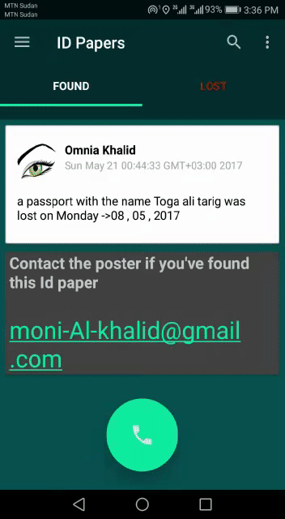
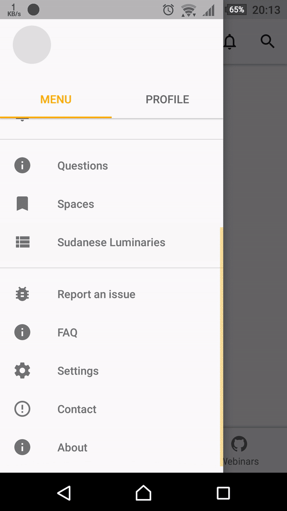
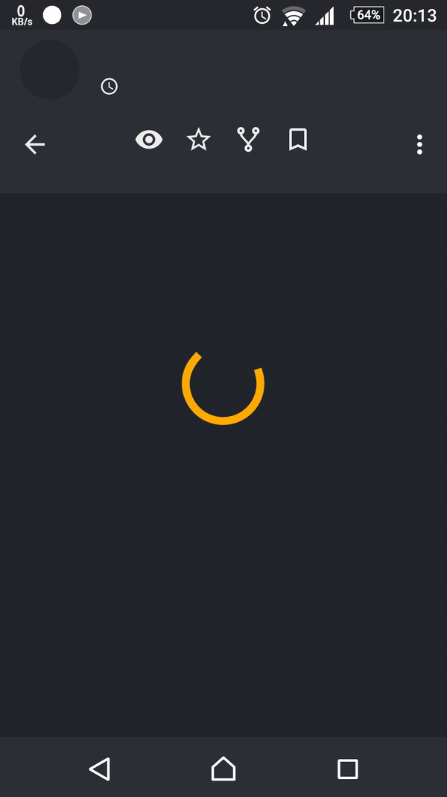

# Work-Samples

## 1.yemen-mazad

collaborated to the development of this app as a freelancer, it's available [here](https://play.google.com/store/apps/details?id=com.yemenmazad&hl=en_US) in the app store.

## 2.El-mejor

It means 'The Best' in spanish ,, `a cross-platform react-native` project that lets you store you fifa games results in the cloud and give you stats about it.

I open sourced it in the Snack. [Here!] (https://snack.expo.io/@maeenbadea/the-best)

## 3.L&F  

short for `Lost & Found` , It's a `native` android application that helps connect those who lost things and the people who found these things.It eliminates the whole process of going to a social media app and asking people to share your post.

## 4.Srf   

It's a `native` android project i built for the Sudanese Research foundation `srf` .Unfortunately the   project got shutdown to due to some managerial problems. 

